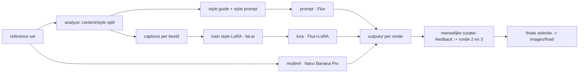

# Opdracht 1 — Visuele stijlkloning

Doel: de visuele stijl van een bestaande campagne analyseren en reproduceren op
nieuwe beelden met andere personen. In plaats van één aanpak te gokken draaien we
**drie generatiestrategieën naast elkaar**, in drie iteratierondes met menselijke
curatie-feedback ertussen — 27 beelden totaal. De beelden kiezen we met de hand;
de matrix maakt de keuze onderbouwbaar.

## Aanpak in het kort

1. **Dubbele stijlanalyse** — eerst een eigen analyse op het oog
   ([analysis/human.md](analysis/human.md)), daarná een AI-analyse per beeld met
   strikte scheiding tussen *content* (wordt LoRA-caption) en *stijl* (wordt
   style guide). De delta tussen beide is onderdeel van het verhaal; de merge
   voedt alle generatie.
2. **Drie strategieën, één baseline** — `prompt` (alleen de gedistilleerde
   style prompt), `multiref` (3–5 campagnebeelden als referentie) en `lora`
   (style-LoRA getraind op de set).
3. **Kleur-nabewerking als aparte as — gebouwd, bewust geparkeerd** — de
   worker bevat een volledige `.cube` LUT-engine (parser + trilineaire
   interpolatie, unit-tested) om grading deterministisch als nabewerking te
   draaien. De handmatige grading-stap zelf (de `.cube` maken in Resolve) is
   binnen de tijdsbox geschrapt; zie verbeterpunten.
4. **Alles meetbaar** — elke provider-call logt kosten naar
   `outputs/costs.json`; `worker costs` maakt er een tabel van.



## Toolkeuze en waarom

| Keuze | Onderbouwing |
|---|---|
| **Flux (fal.ai) als basemodel** voor `prompt` én `lora` | Zelfde basemodel in beide cellen isoleert de LoRA-delta: het verschil tussen die kolommen is *alleen* de training, niet het model. |
| **Nano Banana Pro (Gemini)** voor `multiref` | Sterkste multi-reference beeldmodel van dit moment; test of few-shot referentie een training overbodig maakt. |
| **Style-LoRA via fal.ai** | Reproduceerbaar en goedkoop trainbaar; captions beschrijven alleen content zodat de stijl aan de trigger phrase bindt (minder content leakage). Steps configureerbaar voor een overfitting-vergelijking (500/1000/2000). |
| **LUT-engine in de worker** | Grading is deterministisch na te bootsen; dat hoort niet in de gok van een generatief model. De .cube-parser + trilineaire interpolatie zitten getest in de worker; de handmatige `.cube` zelf is bewust geschrapt (zie verbeterpunten). |
| **Go-worker, local-first** | Queue- en storage-interfaces met env-drivers: default memory-queue + lokaal bestandssysteem (nul infra), optioneel Redis + S3 (Hetzner) als schaal-story. Kosten per job gelogd. |

## Quickstart (Docker, geen Go nodig)

```bash
cp worker/.env.example .env    # vul FAL_API_KEY en GEMINI_API_KEY in
make -C worker docker-build
make -C worker docker-run ARGS="run matrix.yaml"
```

Lokaal met Go 1.24+: `make -C worker run`. Losse stappen: `make -C worker analyze`,
`make -C worker costs`. Tests: `make -C worker test`.

Vereisten vóór de eerste volledige run:
- campagnefoto's in `./data/reference/` (bewust buiten git — niet publiek delen)
- prompts in [matrix.yaml](matrix.yaml) bevestigd

De redis-variant (los enqueuen, meerdere workers) staat als voorbeeld in
[worker/docker-compose.yml](worker/docker-compose.yml) — zo schaalt dit op,
maar het is geen requirement om te draaien.

## Structuur

```
worker/          Go-worker: queue, store, providers, LUT-engine, cost logging
analysis/        human.md (Elmar) · ai/ (gegenereerd) · delta.md · style-guide.md (merge)
lut/             leeg — LUT-as geparkeerd; de engine zit in de worker
outputs/         {prompt,multiref,lora}[-lut]/ + costs.json (gegenereerd)
images/final/    de definitieve beelden (menselijke keuze)
deck/            de 5 slides
matrix.yaml      batchdefinitie van de volledige matrix
```

## Run-log & kosten

Wordt na de run gegenereerd: `make -C worker costs` produceert de
markdown-tabel (per cel: aantal jobs en kosten in USD) die hier en in de deck
landt. Prijzen komen uit de provider-response waar mogelijk en anders uit
geconfigureerde prijzen per beeld/step (bron staat per regel in
`outputs/costs.json`).

## Status

- [x] Worker: queue/store-drivers, 3 varianten, LoRA-training, LUT-engine, cost logging, tests, Docker
- [x] 🧑 Reference-foto's in `data/reference/` (23 beelden, blijven buiten git)
- [x] 🧑 `analysis/human.md` (geschreven vóór het lezen van de AI-analyse)
- [x] AI-analyse: 23 beelden + aggregatie ($0,04) → `analysis/ai/`
- [x] `analysis/delta.md` — mens vs AI, met fotocheck als scheidsrechter
- [x] 🧑 Delta gereviewd + gemergd naar `analysis/style-guide.md`
- [x] 🧑 Prompts vastgesteld (aangepast aan het connectiviteitsthema)
- [x] Matrix gedraaid in 3 iteratierondes met curatie-feedback (27 beelden, $3,69 totaal)
- [x] LUT-as bewust geschrapt na een eigen poging in Resolve — engine blijft getest in de worker; zie verbeterpunten
- [x] 🧑 Curatie: multiref (ronde 3) unaniem winnaar → 3 finals in `images/final/`
- [ ] Deck (5 slides)

## Wat ik anders zou doen met meer tijd/budget

- **De grading-nabewerking daadwerkelijk inzetten**: die mogelijkheid is in
  de tool ontworpen en getest — de worker bevat een volledige `.cube`-engine
  (parser + trilineaire interpolatie) en de matrix kent LUT als eigen as. Eén
  handgemaakte `campaign.cube` in `lut/` en `lut: [false, true]` in
  matrix.yaml, en elke cel krijgt zonder codewijziging een gegradeerde
  variant. Met een kleurgrader — of meer eigen uren in Resolve — duwt die
  laatste stap de generaties nóg dichter op de campagne, en belangrijker: hij
  maakt beelden uit verschillende bronnen (Flux vs Gemini) onderling
  consistenter, omdat alles door dezelfde grade gaat.
- **Meer trainingsdata en een nette LoRA-sweep**: rank en steps systematisch
  vergelijken in plaats van drie steps-waarden; per run een vaste seed-set zodat
  verschillen alleen van de training komen.
- **Brand-LoRA als klant-asset**: bij een doorlopende samenwerking is de LoRA
  een herbruikbaar bezit dat per campagne bijgetraind wordt; eenmalige multiref
  is dan het prototype, de LoRA het product.
- **Identity-behoud**: character reference/face-consistency toevoegen zodat
  dezelfde (fictieve) personen door een campagne heen consistent blijven.
- **Evaluatie hardmaken**: CLIP/DINO-similarity naar de referentieset en een
  klein menselijk panel, in plaats van alleen mijn eigen oog.
- **Upscaling/retouche-stap** vóór levering op drukwerk-resolutie.

## Transparantie

Dit project is gebouwd met Claude Code; het werkplan staat in
[PLAN.md](../PLAN.md) in de root. De stijlanalyse is bewust dubbel uitgevoerd
(mens + AI) en de finale beeldkeuze is menselijk curatiewerk — dat automatiseren
we met opzet niet.
