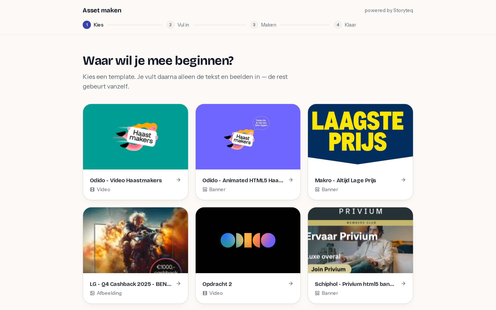
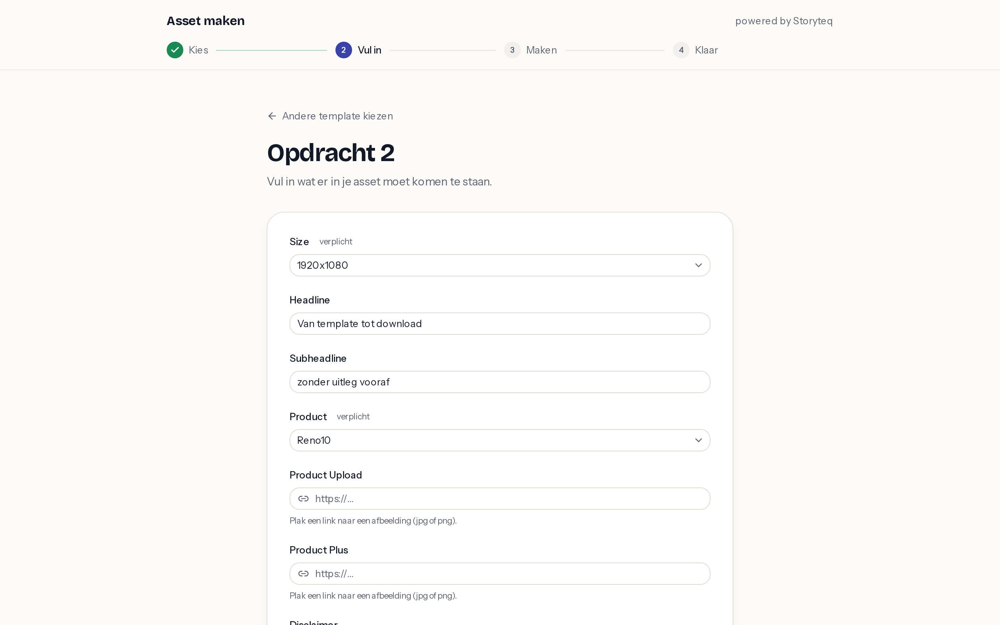
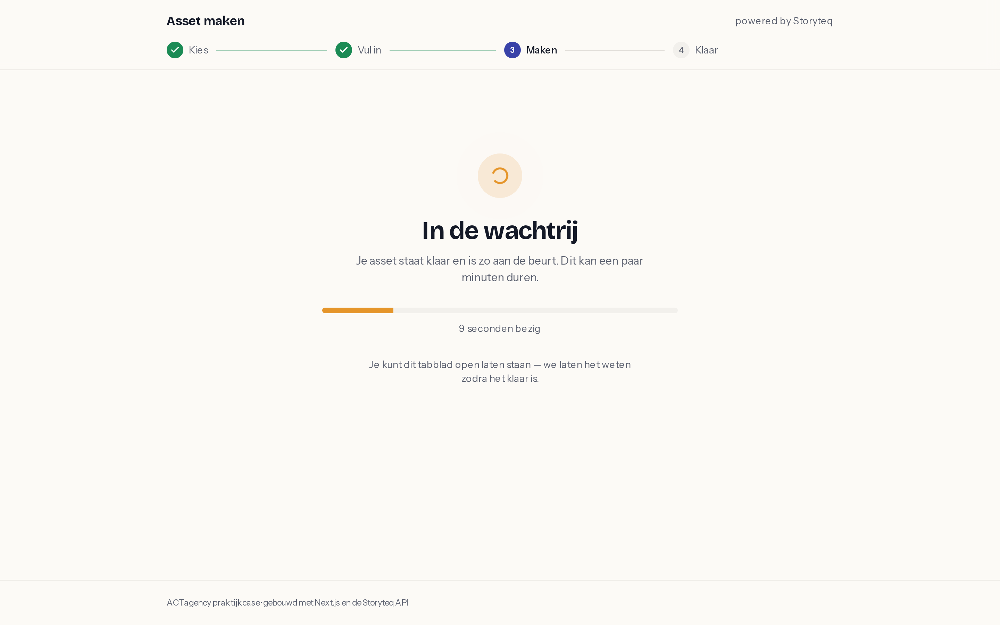
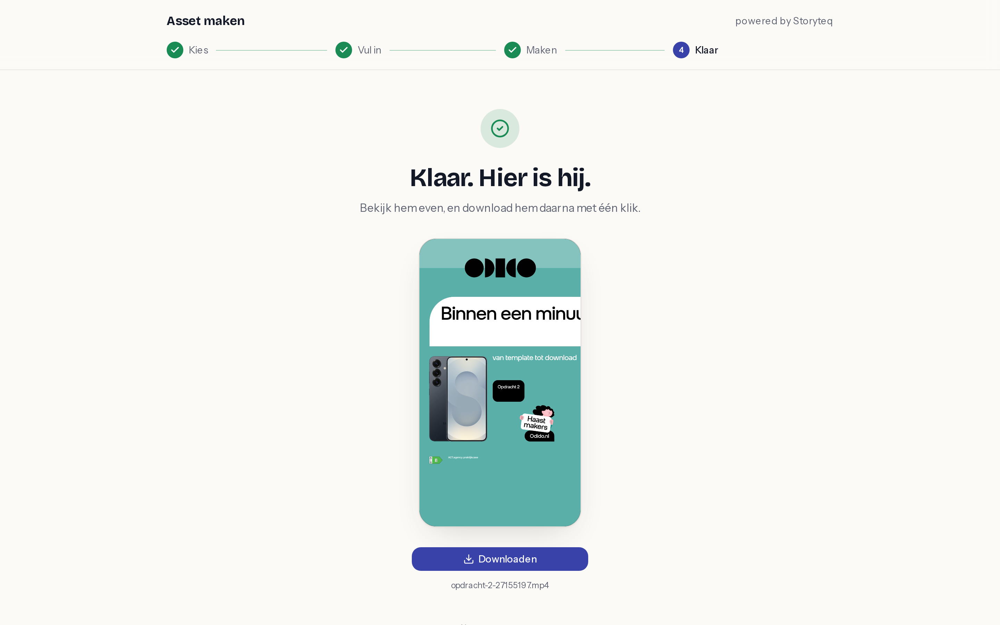

# Opdracht 2 — Storyteq Template Builder

Een Next.js-app waarmee iemand zonder technische achtergrond in vier stappen een
asset maakt: **kies een template → vul in → wacht → download**. Geen dashboard,
geen instellingen, geen jargon.



| Stap 2 — invullen | Stap 3 — genereren | Stap 4 — klaar |
|---|---|---|
|  |  |  |

Mobiel: [kiezen](docs/screenshots/m01-templates.png) ·
[invullen](docs/screenshots/m02-invullen.png) ·
[genereren](docs/screenshots/m03-genereren.png) ·
[klaar](docs/screenshots/m04-klaar.png)

---

## Aanpak in vijf regels

1. **Discovery eerst.** Eerst uitzoeken wat de Storyteq API écht doet, pas daarna
   bouwen. Dat leverde een OpenAPI-spec op die niet in de documentatie stond —
   zie [`docs/api-discovery.md`](docs/api-discovery.md).
2. **Alles via een proxy.** De browser praat uitsluitend met onze eigen route
   handlers. De API-key blijft server-side, en elke call komt langs één plek waar
   hij gelogd kan worden.
3. **Eén lineaire flow.** Vier stappen met de id in de URL, zodat verversen en
   delen werken.
4. **Tolerant parsen, streng presenteren.** Zod accepteert onbekende velden;
   de UI krijgt alleen onze eigen datavorm en nooit rauwe API-output.
5. **Draaien zonder toolchain.** Multi-stage Docker-image, `.env.local` als
   runtime-env.

---

## Snel starten

### Met Node

```bash
cp .env.example .env.local   # vul STORYTEQ_API_KEY én STORYTEQ_COMPANY_ID in
npm install
npm run dev                  # http://localhost:3000
```

> `STORYTEQ_COMPANY_ID` lijkt optioneel maar is dat niet: zodra een token bij
> meerdere companies mag — bij een persoonlijke medewerkers-token dus vrijwel
> altijd — antwoordt Storyteq zonder die header met een 403. Het staat in geen
> enkele documentatie; zie [`docs/api-discovery.md`](docs/api-discovery.md).

### Met alleen Docker

```bash
cp .env.example .env.local
make docker-build
make docker-run              # http://localhost:3000
```

De image draait als non-root en heeft geen Node-toolchain op de host nodig.
`GET /api/health` vertelt of de app draait én of de Storyteq-config compleet is:

```bash
curl -s localhost:3000/api/health
# {"status":"ok","storyteq":"configured","region":"europe-west1","uptime":12}
```

---

## Over die ene minuut

Het doel was: iemand zonder technische achtergrond heeft binnen één minuut een
asset gegenereerd en gedownload. De interface haalt dat — van landing tot op de
knop "Maak mijn asset" zijn het drie handelingen en geen enkel woord uitleg.

De render zelf haalt het niet, en dat ligt niet aan de app: een video op de
testtemplate deed er 220 seconden over, waarvan 120 in de wachtrij van Storyteq.
Dat is niet iets wat een frontend kan versnellen.

Wat de app er wél mee doet: eerlijk zijn. De knop belooft "één tot drie minuten"
in plaats van "een halve minuut", het wachtscherm toont fasen en verstreken tijd
in plaats van een spinner in het niets, de status leeft op een eigen URL zodat
verversen en delen werken, en het pollen loopt door als het tabblad op de
achtergrond staat.

---

## Toolkeuzes, en waarom

| Keuze | Waarom |
|---|---|
| **Next.js (App Router, TypeScript)** | Gevraagd in de opdracht. De route handlers zijn hier meteen de proxy-laag, dus er is geen aparte backend nodig. |
| **Route handlers als proxy** | Drie vliegen: de key blijft server-side, alle traffic komt langs één punt (discovery-logging), en de download kan een eigen `Content-Disposition` krijgen zodat hij écht met één klik binnenkomt. |
| **TanStack Query, geen state manager** | Alles in deze app *is* server state: templates, de aanmaak-actie, de renderstatus. Het pollen is één regel — `refetchInterval` als functie van de status, die vanzelf stopt bij `finished`/`failed`. Er is geen client state die Zustand of Redux zou rechtvaardigen: één wizard-stap (die in de URL staat) en de formuliervelden. |
| **shadcn/ui primitives, geen blocks** | Alleen button, input, textarea, card, progress, skeleton, label en sonner — de bouwstenen, met een eigen theme erop. Bewust géén sidebar- of dashboard-blocks: de opdracht vraagt letterlijk om geen technisch dashboard. |
| **Tailwind v4** | Theme als CSS-variabelen, geen config-bestand nodig. |
| **Zod op de route handlers** | Een API die we niet volledig kennen levert onbetrouwbare responses. Loose schemas: onbekende velden mogen erbij, ontbrekende velden breken de app niet. |
| **Docker multi-stage op `output: 'standalone'`** | De beoordelaar draait de app zonder Node te installeren. |

### Design

Eigen theme op de primitives: warm papier in plaats van steriel wit, diep
inktblauw als tekstkleur, en één accentkleur (indigo) die alleen gebruikt wordt
voor de handeling die je moet doen. Amber betekent "er wordt gewerkt", groen
"klaar". Typografie is Bricolage Grotesque voor de koppen en Instrument Sans voor
alles wat je leest en invult — expliciet geen Inter-op-alles.

De flow is lineair, dus mobiel werkt vrijwel gratis: één kolom, grote raakvlakken,
en de stappenbalk toont op smalle schermen alleen het label van de huidige stap.

---

## Hoe de API verkend is

Het volledige verhaal staat in [`docs/api-discovery.md`](docs/api-discovery.md).
De korte versie:

**De documentatie viel mee.** De docs-site gaf bij een gewone fetch niets terug —
één `<title>` en verder niets. Dat bleek geen kapotte pagina maar een **Swagger
UI**: in de rauwe HTML staan drie OpenAPI-specs die los op te halen zijn. Eén
daarvan, *Storyteq API v4 (Creative Automation)*, beschrijft base URL, bearer-auth,
de vijf endpoints en de webhook-statussen. Dat scheelde een middag endpoints raden.

**En toen viel de spec tegen.** Wat er niet in staat, en wat we met echte calls
moesten uitvinden:

- **`X-Company-Id` is verplicht.** Alleen de bearer-token levert een `403` op:
  *"This user has access to multiple companies."* De spec kent geen
  company-parameter. Dit is het soort ding waar je zonder trial & error op
  vastloopt.
- **De parameter-configuratie is drie keer zo groot als de spec zegt.** De spec
  geeft `TemplateParameter` drie velden (`name`, `label`, `type`); de API geeft er
  achttien terug — waaronder `required` (als `0`/`1`, niet als boolean), `order`,
  `default`, en bij `type: "enum"` een `meta.values` met label/value-paren. Dat
  laatste maakt van drie tekstvelden drie echte keuzelijsten.
- **Parameternamen zijn UUID's** (`parameter-5cdb76a4-…`) en de labels zijn de
  menselijke namen. De UI mag dus nooit de naam tonen.
- **`urls` en `download_urls` zijn geen alternatieven.** De spec noemt ze in twee
  aparte schema's alsof je er één van krijgt. In werkelijkheid bestaan ze allebei:
  `urls` wijst naar de CDN om te bekijken (met Range-support, dus de speler kan
  spoelen), `download_urls` naar `/v4/open/media/{hash}/download/{formaat}`.
- **Een leeg optioneel veld moet je wéglaten.** `"parameter-…": ""` op een
  image-veld geeft een `422 format is invalid` — op een veld dat niet verplicht is.
- **Het lijst-endpoint geeft geen `parameters`.** Je hebt altijd de detail-call
  nodig voor je een formulier kunt bouwen.
- **Timing:** een render van `processing_time: 94` seconden duurde van knop tot
  bestand 220 seconden, waarvan 120 in de wachtrij. `uploading` kwam nooit voorbij.
  De copy in stap 3 belooft daarom "één tot drie minuten" en niets preciezers.

### Het discovery-log

Elke proxy-call landt in `docs/discovery/log.jsonl`: methode, pad, status, timing
en de *vorm* van de response — met de `Authorization`-header geredact en zonder
response-waardes, want dat log wordt gecommit en de token is persoonlijk.

---

## Transparantie over het bouwen

Deze app is gebouwd met **Claude Code**, en dat is een bewuste werkwijze geweest,
geen bijzaak:

- **Plan eerst.** [`../PLAN-2.md`](../PLAN-2.md) is met de hand vastgesteld
  vóórdat er een regel code stond: stack, architectuur, wat bewust *niet* gebouwd
  wordt, en waar menselijke review nodig is.
- **AI heeft gedaan:** de discovery (inclusief het vinden van de OpenAPI-specs),
  de proxy-laag, de zod-schemas en tests, de componenten, de Docker-setup en het
  leeuwendeel van deze documentatie.
- **Mens heeft besloten:** de stack en architectuur, de vorm van de flow, de
  toon van de teksten, het design-oordeel, en de minute-test aan het eind.
- **Bewust niet geautomatiseerd:** het oordeel of de app écht "stupid simple" is.
  Dat is een menselijke test met een stopwatch, geen checklist.

---

## Wat er bewust niet in zit

Geen database, geen accounts, geen auth-laag — de opdracht vraagt er niet om.
Geen state manager (zie hierboven). Geen dashboard-layout. Geen Storybook en geen
e2e-suite; wel unit tests op de zod-parsing, want dáár zit bij een half
gedocumenteerde API het echte risico. Geen websockets: pollen is gevraagd en
volstaat ruim voor renders van tientallen seconden.

---

## Wat beter kan met meer tijd

- **Echte template-previews.** Nu een gegenereerde kleurkaart per template. Met
  een render van de template zelf (of een gecachete eerste asset) wordt kiezen
  een stuk makkelijker.
- **Uitzoeken wat een `image`-parameter echt verwacht.** Dit is de grootste
  openstaande vraag: in alle veertig bestaande media van de testtemplate stond
  `""`. De UI vraagt nu om een URL, maar mogelijk wil Storyteq een asset-id uit
  de eigen DAM. Daarna is uploaden in plaats van een link plakken de volgende
  stap — dat is voor de eindgebruiker veel natuurlijker.
- **Presets per merk.** Kleuren, logo en CTA's die al goed staan, zodat er nog
  minder in te vullen valt.
- **Batch-generatie.** De API ondersteunt het; de opdracht vroeg om één asset.
- **Webhooks in plaats van pollen** voor lange renders, met een e-mail of
  push zodra hij klaar is — dan hoeft het tabblad niet open te blijven.
- **Paginatie op templates**, zodra een account er meer heeft dan één pagina.
  De parameter is bevestigd (`?page=N`, Laravel-stijl), alleen nog niet gebruikt.
- **Templates filteren of groeperen.** Nu komen ze allemaal in één grid; met
  `tags`, `archive` en `favourite` valt daar iets zinnigers van te maken.
- **i18n.** De UI is nu volledig Nederlands.

---

## Projectstructuur

```
app/
  page.tsx                     stap 1 — templates
  maken/[templateId]/          stap 2 — invullen
  asset/[assetId]/             stap 3 en 4 — wachten en downloaden
  api/                         de proxy (templates, thumbnails, assets, download, health)
components/                    UI, incl. shadcn-primitives in components/ui/
lib/
  config.ts                    env inlezen en valideren
  storyteq-transport.ts        de enige plek met de token
  storyteq.ts                  de vier endpoints, zod-geparsed
  dto.ts                       API-vorm → UI-vorm (alle aannames zitten hier)
  discovery.ts                 request/response-logging, auth en company-id geredact
  asset-cache.ts               voorkomt een API-call per Range-request van de speler
  template-cache.ts            thumbnail-URL's uit de lijst-call
  errors.ts                    één foutentaxonomie, menselijke teksten
  queries.ts                   TanStack Query hooks incl. polling
docs/
  api-discovery.md             wat we over de API ontdekten
  specs/                       de opgehaalde OpenAPI-spec
  discovery/log.jsonl          request/response-vormen
  screenshots/
scripts/explore.ts             handmatige API-verkenning
```
